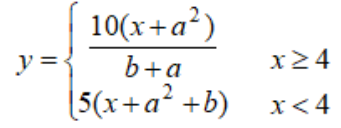
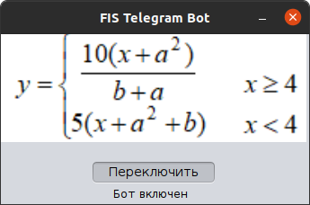
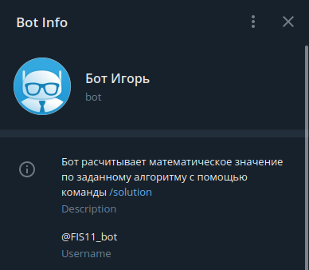
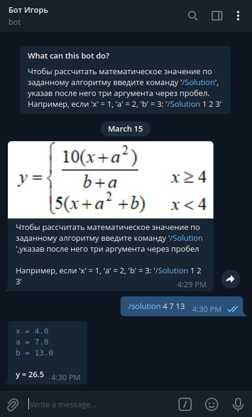

# FIS11_Telegram_Bot
## Разработка многоуровневых приложений
### Чат-бота Telegram на Java для расчета математического значения по заданному алгоритму.
### Лабораторная работа №2
### Вариант - 11
  
  
  
